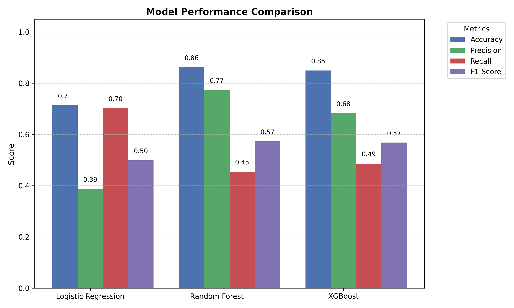

# 💼 Bank Customer Churn Prediction

This project analyzes customer churn behavior in the banking sector using machine learning techniques. The goal is to identify patterns that distinguish customers likely to leave, enabling businesses to take proactive retention measures.

## 🧪 Dataset

- Source: [Kaggle](https://www.kaggle.com/datasets/shubhendra7/customer-churn-prediction)
- Contains demographic and banking behavior data for 10,000 customers

## ⚙️ Models Used

- Logistic Regression
- Random Forest
- XGBoost

## 📊 Evaluation Metrics

Each model was evaluated using the following metrics:
- Accuracy
- Precision
- Recall
- F1-Score

Results are presented in tabular and graphical format for easy comparison.

## 📈 Key Insights

- XGBoost achieved the highest performance across all metrics.
- Random Forest showed competitive results with balanced accuracy and recall.
- Logistic Regression served as a baseline for benchmarking.

## 📊 Model Performance Comparison

## 🧠 Tools & Libraries

- Python (pandas, matplotlib, seaborn, scikit-learn, xgboost)
- Jupyter Notebook

